# Projeto `<Especificando Componentes>`

# Equipe 3
* Nome: Jhovani César Merisse 
* Nome: Jonathan Xavier 
* Nome: Marcelo de Souza Tamashiro 
* Nome: Rebeca Paulino de Morais 
* Nome: Renan Alves da Silva 
* Nome: Rodrigo Yokoo Siqueira Bueno 

# Nível 1

## Diagrama Geral do Nível 1

> 

### Detalhamento da interação de componentes

O detalhamento deve seguir um formato de acordo com o exemplo a seguir:

* O componente `Cliente` solicita a abertura de um leilão publicando no barramento a mensagem do tópico `"leilao/solicitacao/<produto>"` através da interface `Solicita Leilão`;
* O componente `Leilão` assina no barramento mensagens do tópico `"leilao/solicitacao/+"` através da interface `Pedido Leilão`. Quando recebe uma mensagem o componente registra o leilão e define horário de início e fim.
* O componente `Leilão` efetua a abertura de um leilão publicando no barramento a mensagem do tópico `"leilao/<identificador>/inicio"` através da interface `Controle Leilão`;
* O componente `Fornecedor` assina no barramento mensagens do tópico `"leilao/+/inicio"` através da interface `Monitora Leilão`. Quando recebe uma mensagem o componente notifica o fornecedor que um leilão foi iniciado
* O componente `Fornecedor` efetua um lance publicando no barramento a mensagem do tópico `"leilao/<identificador>/lance"` através da interface `Efetua Lance`;
* O componente `Histórico` de Lance assina no barramento mensagens do tópico `"leilao/+/lance"` através da interface `Recebe Lance`. Quando recebe uma mensagem o componente registra as informações do leilão, valor do lance, fornecedor, data e hora do lance;
* O componente `Leilão` assina no barramento mensagens do tópico `"leilao/+/lance"` através da interface `Recebe Lance`. Quando recebe uma mensagem o componente atualiza o fornecedor com o menor lance do momento;
* O componente `Leilão` informa o menor lance atual publicando no barramento a mensagem do tópico `“leilao/<identificador>/status”` através da interface `Controle Leilão`;
* O componente `Fornecedor` assina no barramento mensagens do tópico `“leilao/+/status”` através da interface `Monitora Leilão` . Quando recebe uma mensagem o componente notifica o fornecedor que houve atualização do menor lance;
* O componente `Leilão` finaliza o leilão publicando no barramento a mensagem do tópico `"leilão/<identificador>/finalizado"` através da interface `Controle Leilão`.
* O componente `Cliente` assina no barramento mensagens do tópico `"leilão/+/finalizado"` através da interface `Resultado Leilão`. Quando recebe a mensagem notifica ao cliente qual o fornecedor ganhador e valor a ser pago;
* O componente `Fornecedor` assina no barramento mensagens do tópico `"leilão/+/finalizado"` através da interface `Monitora Leilão`. Quando recebe a mensagem verifica se é o fornecedor ganhador e, caso seja, faz a separação do produto;
* O componente `Cliente` efetua o pagamento publicando no barramento a mensagem do tópico `"pagamento/<identificador>/solicita"` através da interface `Efetua pagamento`;
* O componente `Pagamento` assina no barramento mensagens do tópico `"pagamento/+/solicita"` através da interface `Solicita Pagamento`. Quando recebe a mensagem o componente verifica os dados e faz o pagamento junto as instituições financeiras;
* O componente `Pagamento` publica o status do pagamento publicando no barramento a mensagem do tópico `"pagamento/<identificador>/status/<status>"` através da interface `Status Pagamento`;
* O componente `Fechamento do Pedido` assina o barramento mensagens do tópico `"pagamento/+/status/pago"` através da interface `Recebe Pagamento`. Quando recebe uma mensagem faz o fechamento do pedido;

Para cada componente será apresentado um documento conforme o modelo a seguir:

## Componente Cliente

> Esse componente tem como papel a exibição da interface onde o cliente possa efetuar a solicitação de um produto por leilão invertido, receber o resultado do leilão e efetuar o pagamento para o fornecedor vencedor.

**Interfaces**
> * Solicita Leilão
> * Resultado Leilão
> * Efetua Pagamento

As interfaces listadas são detalhadas a seguir:

## Detalhamento das Interfaces

### Interface `Solicita Leilão`

> Interface responsável por publicar a solicitação de abertura de um novo leilão

**Tópico**: `leilao/solicitacao/<produto>`

Classes que representam objetos JSON associados às mensagens da interface:

~~~json
{
  "id": 293012,
  "data": "2020-09-11",  
  "quantidade": 2,
  "Produto": {
      "id": "20",
      "nome": "Celular"
  }
}
~~~

Detalhamento da mensagem JSON:

Pedido

Atributo | Descrição
-------| --------
`id` | `identificador do pedido`
`data` | `data que o pedido foi efetuado`
`quantidade` | `quantidade de unidades do produto`
`Produto` | `quantidade de unidades do produto`

Produto

Atributo | Descrição
-------| --------
`id` | `identificador do produto`
`nome` | `nome do produto`
`descricao` | `descrição do produto`

### Interface `Resultado Leilão`

> Interface responsável por verificar o fim do leilão e informar ao cliente qual foi o lance vencedor

**Tópico**: `leilão/+/finalizado`

Classes que representam objetos JSON associados às mensagens da interface:

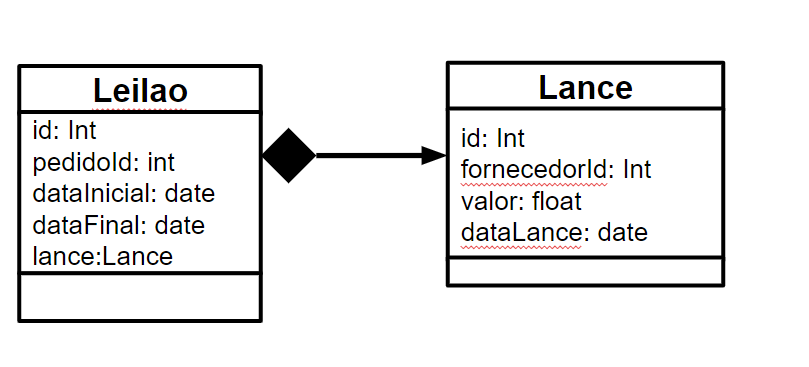

~~~json
{
  "id": 1,
  "pedidoId": "293012",  
  "dataInicial": "2020-09-11 10:00:00",
  "dataFinal": "2020-09-11 11:00:00",
  "Lance": {
      "id": "200",
      "fornecedorId": 1,
      "valor": 200.00,
      "dataLance": "2020-09-11 10:20:14"
  }
}
~~~

Detalhamento da mensagem JSON:

Leilão

Atributo | Descrição
-------| --------
`id` | `identificador do leilão`
`pedidoId` | `id do leilão`
`dataInicial` | `data de início do leilão`
`dataFinal` | `data final do leilão`
`Lance` | `detalhes do lance vencedor`

Lance

Atributo | Descrição
-------| --------
`id` | `identificador do lance`
`fornecedorId` | `id do fornecedor`
`valor` | `valor do lance`
`dataLance` | `data e hora em que o lance foi efetuado`

### Interface `Efetua Pagamento`

> Interface responsável por enviar os dados de pagamento de acordo com o lance vencedor

**Tópico**: `pagamento/<identificador>/solicita`

Classes que representam objetos JSON associados às mensagens da interface:

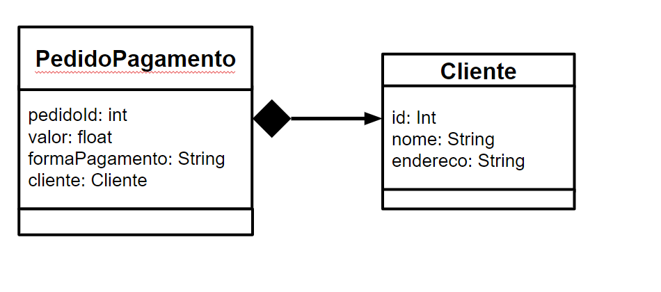

~~~json
{
  "pedidoId": 2032,  
  "valor": 200.00,
  "formaPagamento" : "Boleto Bancário",
  "Cliente": {
      "id": "20",
      "nome": "XPTO",
      "endereco": "Rua xyz, Cidade ABC, 00000-000"
  }
}
~~~

Detalhamento da mensagem JSON:

Pedido

Atributo | Descrição
-------| --------
`pedidoId` | `Identificador do pedido`
`valor` | `valor total para pagamento`
`forma de pagamento` | `definição da forma de pagamento`
`Cliente` | `Informações do cliente`

Cliente

Atributo | Descrição
-------| --------
`id` | `identificador do cliente`
`nome` | `nome do cliende`
`endereco do cliente` | `endereço do cliente`

## Componente Fornecedor

> Esse componente tem como papel monitorar os leilões e efetuar lances para os leilões dos produtos solicitados pelos clientes

> * Monitora Leilão
> * Efetua Lance

As interfaces listadas são detalhadas a seguir:

## Detalhamento das Interfaces

### Interface `Monitora Leilão`

> Interface responsável por publicar notificações quando o leilão é iniciado

**Tópico**: `leilao/+/inicio`

Classes que representam objetos JSON associados às mensagens da interface:

~~~json
{
  "id": 1,
  "pedidoId": "293012",  
  "dataInicial": "2020-09-11 10:00:00",
  "dataFinal": "2020-09-11 11:00:00",
  "Lance": {
      "id": "200",
      "fornecedorId": 1,
      "valor": 200.00,
      "dataLance": "2020-09-11 10:20:14"
  }
}
~~~

Detalhamento da mensagem JSON:

Leilão

Atributo | Descrição
-------| --------
`id` | `identificador do leilão`
`pedidoId` | `id do leilão`
`dataInicial` | `data de início do leilão`
`dataFinal` | `data final do leilão`
`Lance` | `detalhes do lance vencedor`

Lance

Atributo | Descrição
-------| --------
`id` | `identificador do lance`
`fornecedorId` | `id do fornecedor`
`valor` | `valor do lance`
`dataLance` | `data e hora em que o lance foi efetuado`

### Interface `Efetua Lance`

> Interface responsável por publicar um lance efetuado pelo fornecedor

**Tópico**: `leilao/<identificador>/lance`

Classes que representam objetos JSON associados às mensagens da interface:

~~~json
{
  "id": 1,
  "pedidoId": "293012",  
  "dataInicial": "2020-09-11 10:00:00",
  "dataFinal": "2020-09-11 11:00:00",
  "Lance": {
      "id": "200",
      "fornecedorId": 1,
      "valor": 200.00,
      "dataLance": "2020-09-11 10:20:14"
  }
}
~~~

Detalhamento da mensagem JSON:

Leilão

Atributo | Descrição
-------| --------
`id` | `identificador do leilão`
`pedidoId` | `id do leilão`
`dataInicial` | `data de início do leilão`
`dataFinal` | `data final do leilão`
`Lance` | `detalhes do lance vencedor`

Lance

Atributo | Descrição
-------| --------
`id` | `identificador do lance`
`fornecedorId` | `id do fornecedor`
`valor` | `valor do lance`
`dataLance` | `data e hora em que o lance foi efetuado`

## Componente Pagamento

> Esse componente tem como papel solicitar o pagamento do produto e publicar no barramento o status do pagamento

> * Solicita Pagamento
> * Status Pagamento

As interfaces listadas são detalhadas a seguir:

## Detalhamento das Interfaces

### Interface `Solicita Pagamento`

> Interface responsável por receber a solicitação de pagamento.

**Tópico**: `pagamento/+/solicita`

Classes que representam objetos JSON associados às mensagens da interface:

~~~json
{
  "pedidoId": 2032,  
  "valor": 200.00,
  "formaPagamento" : "Boleto Bancário",
  "Cliente": {
      "id": "20",
      "nome": "XPTO",
      "endereco": "Rua xyz, Cidade ABC, 00000-000"
  }
}
~~~

Detalhamento da mensagem JSON:

Pedido

Atributo | Descrição
-------| --------
`pedidoId` | `Identificador do pedido`
`valor` | `valor total para pagamento`
`forma de pagamento` | `definição da forma de pagamento`
`Cliente` | `Informações do cliente`

Cliente

Atributo | Descrição
-------| --------
`id` | `identificador do cliente`
`nome` | `nome do cliende`
`endereco do cliente` | `endereço do cliente`

### Interface `Status Pagamento`

> Interface responsável por verificar, efetuar o pagamento junto as instituições financeiras e retorna se o pagamento foi ou não efetuado.
**Tópico**: `pagamento/<identificador>/status/<status>`

Classes que representam objetos JSON associados às mensagens da interface:

~~~json
{
  "pedidoId": 2032,  
  "valor": 200.00,
  "formaPagamento" : "Boleto Bancário",
  "statusPagamento" : true,
  "Cliente": {
      "id": "20",
      "nome": "XPTO",
      "endereco": "Rua xyz, Cidade ABC, 00000-000"
  }
}
~~~

Detalhamento da mensagem JSON:

Pedido

Atributo | Descrição
-------| --------
`pedidoId` | `Identificador do pedido`
`valor` | `valor total para pagamento`
`forma de pagamento` | `definição da forma de pagamento`
`status do pagamento` | `status do pagamento`
`Cliente` | `Informações do cliente`

Cliente

Atributo | Descrição
-------| --------
`id` | `identificador do cliente`
`nome` | `nome do cliende`
`endereco do cliente` | `endereço do cliente`

## Componente Leilão

> Esse componente tem como papel receber um pedido de leilão, receber os lances do leilão e controlar o leilão publicando no barramento qual o menor lance.

> * Pedido Leilão
> * Controle Leilão
> * Recebe Lance

As interfaces listadas são detalhadas a seguir:

## Detalhamento das Interfaces

### Interface `Pedido Leilão`

> Interface responsável por receber solitação de leilão e define o horario de inicio e fim

**Tópico**: `leilao/solicitacao/+`

Classes que representam objetos JSON associados às mensagens da interface:

~~~json
{
  "id": 293012,
  "data": "2020-09-11",  
  "quantidade": 2,
  "Produto": {
      "id": "20",
      "nome": "Celular"
  }
}
~~~

Detalhamento da mensagem JSON:

Pedido

Atributo | Descrição
-------| --------
`id` | `identificador do pedido`
`data` | `data que o pedido foi efetuado`
`quantidade` | `quantidade de unidades do produto`
`Produto` | `quantidade de unidades do produto`

Produto

Atributo | Descrição
-------| --------
`id` | `identificador do produto`
`nome` | `nome do produto`
`descricao` | `descrição do produto`

### Interface `Controle Leilão`

> Interface responsável por efetuar a abertura do leilão

**Tópico**: `leilao/<identificador>/inicio`

Classes que representam objetos JSON associados às mensagens da interface:

~~~json
{
  "id": 1,
  "pedidoId": "293012",  
  "dataInicial": "2020-09-11 10:00:00",
  "dataFinal": "2020-09-11 11:00:00",
  "Lance": {
      "id": "200",
      "fornecedorId": 1,
      "valor": 200.00,
      "dataLance": "2020-09-11 10:20:14"
  }
}
~~~

Detalhamento da mensagem JSON:

Leilão

Atributo | Descrição
-------| --------
`id` | `identificador do leilão`
`pedidoId` | `id do leilão`
`dataInicial` | `data de início do leilão`
`dataFinal` | `data final do leilão`
`Lance` | `detalhes do lance vencedor`

Lance

Atributo | Descrição
-------| --------
`id` | `identificador do lance`
`fornecedorId` | `id do fornecedor`
`valor` | `valor do lance`
`dataLance` | `data e hora em que o lance foi efetuado`

### Interface `Recebe Lance`

> Interface responsável por receber o lance de um produto e atualizar com o menor valor.

**Tópico**: `leilao/+/lance`

Classes que representam objetos JSON associados às mensagens da interface:

~~~json
{
  "id": 1,
  "pedidoId": "293012",  
  "dataInicial": "2020-09-11 10:00:00",
  "dataFinal": "2020-09-11 11:00:00",
  "Lance": {
      "id": "200",
      "fornecedorId": 1,
      "valor": 200.00,
      "dataLance": "2020-09-11 10:20:14"
  }
}
~~~

Detalhamento da mensagem JSON:

Leilão

Atributo | Descrição
-------| --------
`id` | `identificador do leilão`
`pedidoId` | `id do leilão`
`dataInicial` | `data de início do leilão`
`dataFinal` | `data final do leilão`
`Lance` | `detalhes do lance vencedor`

Lance

Atributo | Descrição
-------| --------
`id` | `identificador do lance`
`fornecedorId` | `id do fornecedor`
`valor` | `valor do lance`
`dataLance` | `data e hora em que o lance foi efetuado`

## Componente Historico de Lance

> Esse componente tem como papel registrar as informações de cada leilão, valor do lance, fornecedor, data e hora do lance;

> * Recebe Lance

As interfaces listadas são detalhadas a seguir:

## Detalhamento das Interfaces

### Interface `Recebe Lance`

> Interface responsável por registrar as informações do lance.

**Tópico**: `leilao/+/lance`

Classes que representam objetos JSON associados às mensagens da interface:

~~~json
{
  "id": 1,
  "pedidoId": "293012",  
  "dataInicial": "2020-09-11 10:00:00",
  "dataFinal": "2020-09-11 11:00:00",
  "Lance": {
      "id": "200",
      "fornecedorId": 1,
      "valor": 200.00,
      "dataLance": "2020-09-11 10:20:14"
  }
}
~~~

Detalhamento da mensagem JSON:

Leilão

Atributo | Descrição
-------| --------
`id` | `identificador do leilão`
`pedidoId` | `id do leilão`
`dataInicial` | `data de início do leilão`
`dataFinal` | `data final do leilão`
`Lance` | `detalhes do lance vencedor`

Lance

Atributo | Descrição
-------| --------
`id` | `identificador do lance`
`fornecedorId` | `id do fornecedor`
`valor` | `valor do lance`
`dataLance` | `data e hora em que o lance foi efetuado`

## Componente Fechamento do Pedido

> Esse componente tem como papel receber o pagamento do cliente e fechar o pedido.

> * Recebe Pagamento

As interfaces listadas são detalhadas a seguir:

## Detalhamento das Interfaces

### Interface `Recebe Pagamento`

> Interface responsável por fazer o fechamento do pedido

**Tópico**: `pagamento/+/status/pago`

Classes que representam objetos JSON associados às mensagens da interface:

~~~json
{
  "pedidoId": 2032,  
  "valor": 200.00,
  "formaPagamento" : "Boleto Bancário",
  "statusPagamento" : true,
  "Cliente": {
      "id": "20",
      "nome": "XPTO",
      "endereco": "Rua xyz, Cidade ABC, 00000-000"
  }
}
~~~

Detalhamento da mensagem JSON:

Pedido

Atributo | Descrição
-------| --------
`pedidoId` | `Identificador do pedido`
`valor` | `valor total para pagamento`
`forma de pagamento` | `definição da forma de pagamento`
`status do pagamento` | `status do pagamento`
`Cliente` | `Informações do cliente`

Cliente

Atributo | Descrição
-------| --------
`id` | `identificador do cliente`
`nome` | `nome do cliende`
`endereco do cliente` | `endereço do cliente`

# Nível 2

> 

### Detalhamento da interação de componentes

* O componente `ClienteView` é responsável por prover uma interface gráfica para o usuário, o mesmo é composto por mais dois componentes, sendo eles `Selecão de Produtos` e `Pagamento`.
* O componente `ClienteController` é um controlador composto por mais dois subcomponentes, sendo eles `Processar Produtos` e `Processar Pagamentos`.
* O componente `ClienteView` tem um ponto de entrada através do subcomponente `Seleção de Produtos` que recebe a interface `Seleciona Produto`.
* Através desta interface o subcomponente `Seleção de Produtos` envia uma mensagem para o barramento através do tópico `produtos/<produto>/solicitamelhorpreco`.
* O componente `ClienteController` assina o tópico `produtos/<produto>/solicitamelhorpreco` através da interface `Consultar Melhor Preço` e comunica o subcomponente `Processar Produtos` que envia uma mensagem para o barramento através do tópico "leilao/solicitacao/<produto>".
* Após receber a resposta do barramento através da interface `Resultado Leilão` o componente `ClienteController` comunica o subcomponente `Processar Produtos` que assina o tópico `produtos/recebemelhorpreco`, através da interface interface `Melhor Preço Fornecedor`.
* O componente `ClienteView` recebe a mensagem e comunica o subcomponente `Seleção de Produtos`, onde o mesmo se comunica com o subcomponente `Pagamento` que exibirá o melhor preço para o usuário.
* O subcomponente `Pagamento` possui uma entrada que recebe a interface `Informa a Forma de Pagamento`.
* Através desta interface o subcomponente `Pagamento` envia uma mensagem para o barramentro através do tópico `pagamento/<formapagamento>/efetuapagamento`.
* O componente `ClienteController` assina o tópico `pagamento/<formapagamento/efetuapagamento>` através da interface `Efetua Pagamento` e comunica o subcomponente `Processar Pagamentos` que envia uma mensagem para o barramento através do tópico `pagamento/+/solicita"`.

## Componente Seleção de Produtos

> Componente responsável por exibir os produtos ao usuário

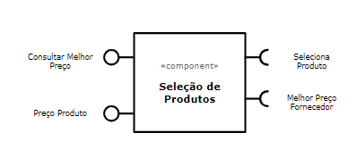

**Interfaces**

As interfaces listadas são detalhadas a seguir:

## Detalhamento das Interfaces

### Interface Consultar Melhor Preço

> 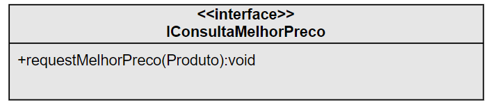

Interface utilizada para requisitar o melhor preço de um dado produto através de uma mensagem no barramento.

Método | Objetivo
-------| --------
requestMelhorPreco | Método utilizado para publicar no barramento a solicitação do melhor preço para um dado produto, passado como parâmetro de entrada.

### Interface Preço Produto

> 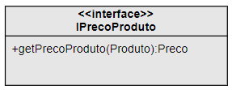

Interface que retorna informações de preço de um produto

Método | Objetivo
-------| --------
getPrecoProduto | Método que retorna as informações de preço de um dado produto, passado como parâmetro de entrada.

### Interface Seleciona Produto

> 

Interface utilizada para exibir os produtos a partir de um nome

Método | Objetivo
-------| --------
setProduct | Metodo utilizado para visualizar todos os os produtos a partir de um nome de entrada

### Interface Melhor Preço Fornecedor

> 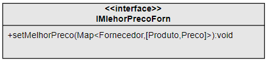

Interface para receber as melhores ofertas vindas dos fornecedores

Método | Objetivo
-------| --------
setMelhorPreco | Método que recebe e registra um ranking dos fornecedores com melhores preços para o produto requisitado

## Componente Pagamentos

> Componente utilizado para exibir informações de pagamento ao usuário

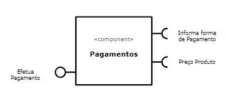

**Interfaces**

As interfaces listadas são detalhadas a seguir:

## Detalhamento das Interfaces

### Interface Efetuar Pagamentos

> 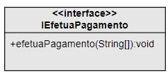

Interface utilizada para publicar informaçoes de pagamento no barramento.

Método | Objetivo
-------| --------
efetuaPagamento | Método utilizado para efetuar o pagamento de um determinado produto, enviando informações através de mensagem no barramento

### Interface Informa Forma de Pagamento

> 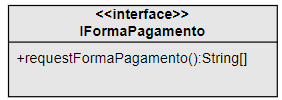

Interface para registrar as informaçoes de pagamento informadas pelo usuario

Método | Objetivo
-------| --------
requestFormaPagamento | Metodo para registrar as informaçoes de pagamento

### Interface Preço Produto

> 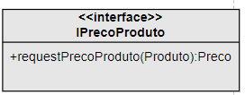

Interface utilizada para solicitar o preço de um produto

Método | Objetivo
-------| --------
requestPrecoProduto | Método que requisita o preço de um determinado Produto

## Componente Processar Produtos

> Responsável por consolidar as ofertas dos fornecedores para o produto selecionado

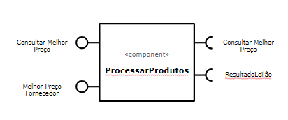

**Interfaces**

As interfaces listadas são detalhadas a seguir:

## Detalhamento das Interfaces

### Interface Consultar Melhor Preço

> 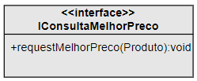

Interface utilizada para solicitar o menor preço de um determinado produto

Método | Objetivo
-------| --------
requestMelhorPreco | Método que recebe a requisição de menor de um produto

### Interface Melhor Preço Fornecedor

> 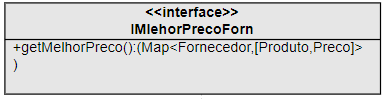

Interface utilizada para publicar uma lista com melhores preços e fornecedores para um dado produto

Método | Objetivo
-------| --------
getMelhorPreco | Método que publica uma lista com melhores preços e fornecedores para um dado produto no barramento

### Interface Consultar Melhor Preço

> 

Interface utilizada para requisitar o melhor preço, através de um leilão, de um dado produto através de uma mensagem no barramento.

Método | Objetivo
-------| --------
requestMelhorPreco | Método utilizado para publicar no barramento a solicitação do melhor preço para um dado produto,através de um leilão.

### Interface Resultado Leilão

> 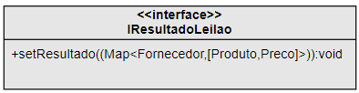

Interface que recebe os resultados do leilão de um produto.

Método | Objetivo
-------| --------
setResultado | Método que recebe uma lista com os resultado dos fornecedores e seus respectivos preços, para um dado produto.

## Componente Processar Pagamentos

> Responsável por gerenciar o pagamento do usuário, de um determinado produto 

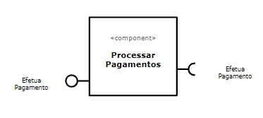

**Interfaces**

As interfaces listadas são detalhadas a seguir:

## Detalhamento das Interfaces

### Interface Efetuar Pagamento

> 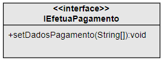

Interface utilizada para requisitar informacoes de um pagamento.

Método | Objetivo
-------| --------
setDadosPagamento | Método que recebe e registra informações de pagamento.

### Interface Efetuar Pagamento

> 

Interface utilizada para publicar informaçoes de pagamento no barramento.

Método | Objetivo
-------| --------
efetuaPagamento | Método utilizado para efetuar o pagamento de um determinado produto, enviando informações através de mensagem no barramento

# Multiplas Interfaces

Para oferecer suporte às interfaces gráficas solicitadas (Web e Android nativo), optou-se pela separação do sistema em duas partes: 

- Front-end, contendo uma aplicação web desenvolvida em javascript sobre o framework Angular 10 e um aplicativo Android nativo desenvolvido em Kotlin, com Android SDK com API Level 22 ou superior;

- Back-end, onde residiria uma API REST desenvolvida em C Sharp sobre ASP.NET Core 3.,1 para consumo tanto pela aplicação web como pelo aplicativo Android. O banco de dados utilizado seria o MySql e também seria oferecido o phpMyAdmin para facilitar a administração do banco.

Pensando em escalabilidade, seriam utilizados containers Docker tanto para a aplicação Web do front-end como para a API REST do back-end, esta última com containers separados para os componentes ASP.NET Core, MySql e phpMyAdmin.

A hospedagem dos containers poderia ser feita em algum provedor cloud, como AWS ou Azure.

Como nesta arquitetura as views são totalmente independentes do controller e model, seria possível adicionar outras interfaces como iOS ou React com facilidade, sem a necessidade de alterar qualquer componente do back-end, atendendo assim os requisitos do presente trabalho.

> 

> 

> 

